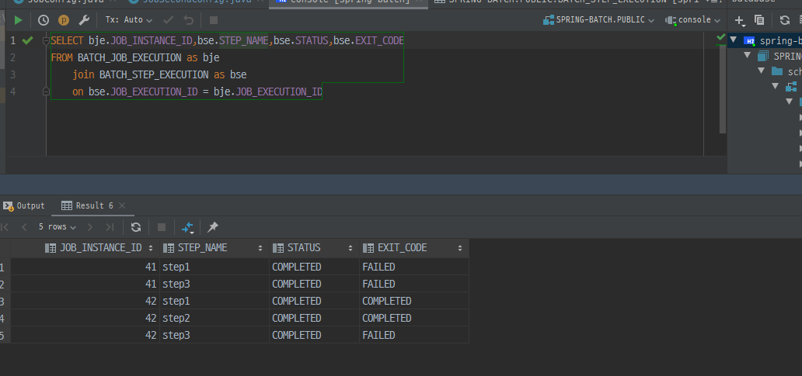
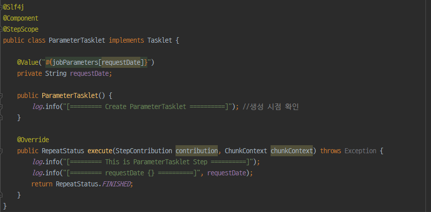
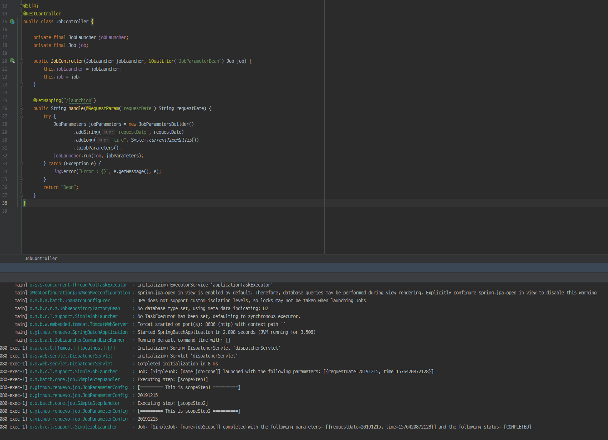
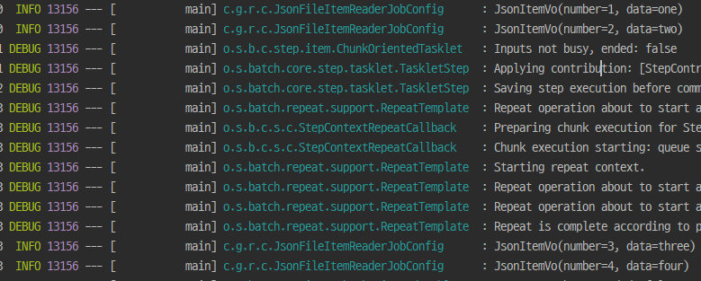
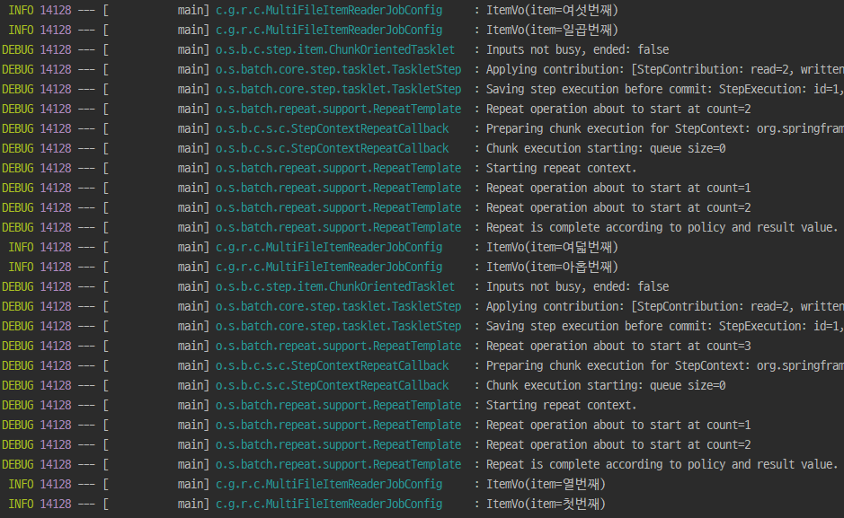
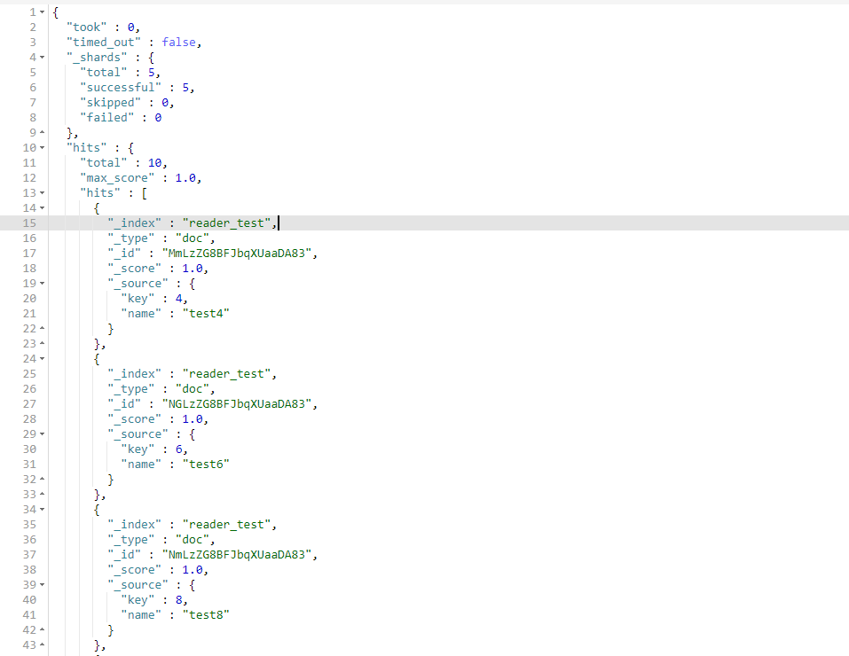

# Spring Batch

1부는 Spring Batch의 구조와 동작 방식의 대한 이야기를 다룹니다  
***Spring의 DI,AOP,서비스 + [Accenture](https://www.accenture.com/us-en)의 Batch 노하우***  
해당 포스팅의 모든 소스는 [Github](https://github.com/renuevo/spring-boot-in-action)에서 확인하실 수 있습니다  

<br/>

*Batch 를 통한 일괄처리*

***Spring Batch의 특성***

1. 자동화 - 개입 없이 `자동 실행`
2. 견고성 - `충돌/중단` 없는 안전한 처리
3. 신뢰성 -  이슈 처리를 추적 할 `로깅/알림` 기능
4. 성능 - 처리 완료와 독립적 수행의 대한 `퍼포먼스` 확보

------


## Data `Reader`와 `Writer`를 지원  

| DataSource | 기술      | 설명                          |
| ---------- | --------- | ----------------------------- |
| Database   | JDBC      | 페이징, 커서, 일괄 업데이트등 |
| Database   | Hibernate | 페이징, 커서                  |
| Database   | JPA       | 페이징 (커서 기능 삭제됨)     |
| File       | Flat file | 지정한 구분자로 파싱          |
| File       | XML       | XML 파싱                      |

```
Ibatis 모듈은 현재 삭재 되었고 JDBC ItemReader로 교체를 추천  
```


------


## Spring Batch 기본 구조  
Spring Batch 실행을 위해서는 다음과 같이 SpringApplication에 annotation을 선언해 주는것 부터 시작합니다    

```java
@EnableBatchProcessing /* highlight-line */  
@SpringBootApplication  
public class BatchApplication {

    public static void main(String[] args) {
        SpringApplication.run(BatchApplication.class, args);
    }
}
```

<br/>

다음으로 Spring Batch의 구조를 확인하겠습니다  
Spring Batch는 크게 계층형 구조를 이루고 있습니다  

<br/>

**Job > Step > Task**  

<br/>


 <span class='img_caption'>Source : [Spring Batch Architecture](https://terasoluna-batch.github.io/guideline/5.0.0.RELEASE/en/Ch02_SpringBatchArchitecture.html) </span> 

위에 그림에서 처럼 Job은 Step을 가지고 있고 Step은 Tasklet 인터페이스를 통해 수행 작업들을 가지고 있습니다  
Task는 기본적인 **사용자 정의 형식**과 **read / process / write (RPW) 형식**이 존재합니다  
그럼 각각의 요소들을 정리해 보겠습니다  

**1. Job**

- Batch Job의 한 단위

  ```java
      @Bean
      public Job jobBean(){
          return jobBuilderFactory.get("{Job Name}")
                  .start(stepBean())
                  .build();
      }
  ```

  

**2. Step**

- Job내부에서 수행될 1개의 Step

- Tasklet에 Step에서 수행할 기능으로 써 2가지의 형태가 존재

  - User 커스텀
  - Reader & Processor & Writer(RPW)가 한 묶음으로 존재

  ```java
      @Bean
      public Step stepBean(){
          return stepBuilderFactory.get("{Step Name}")
                  /* highlight-range{1-4} */
                  .tasklet(((contribution, chunkContext) -> { 
                      log.info("[========= This is Step ==========]");
                      return RepeatStatus.FINISHED;
                  }))
                  .build();
      }
  ```

<br/>

**파라미터로 Job 실행 지정하기**

Spring Batch는 자체적으로 스케줄 처리를 하는 기능이 없습니다  
그래서 외부에서 Crontab / Jenkins 등을 사용해서 Job을 실행하게 됩니다  
이때 program argument를 통해 job name을 전달해서 원하는 job을 실행 하실 수 있습니다  

  ```java
      @Bean
      public Job jobBean(){
          return jobBuilderFactory.get("jpaItemListWriterJob")
                  .start(stepBean())
                  .build();
      }
  ```

```yaml
spring:
  batch:
    job:
      names: ${job.name:NONE}
```

원하는 job을 외부 파라미터로 실행할 경우 다음과 같이 properties로 지정해 줍니다  
properties를 다음과 같이 지정하므로 모든 job이 실행되는 것을 미연에 방지할 수 있습니다  
그리고 다음으로 program argument 파라미터를 지정해 주시면 됩니다  

<br/>

예를 들어 **jpaItemListWriterJob** 이라는 job을 실행하고 싶을 경우 다음과 같이 해주시면 됩니다  
```
program argument : --job.name=jpaItemListWriterJob
```


------


## Srping Boot Meta Data
Spring Batch에서는 DB를 통해 `완료/실패`와 같은 `상태관리`를 합니다  
크게 4가지의 상태를 DB에 저장하는데  

1. 이전 실행 Job History
2. 실패한 Batch와 Parameter / 성공한 Job
3. 실행 재개 지점
4. Job 기준 Step현황과 성공/실패 여부


 <span class='img_caption'>Source : [Spring Batch Doc](https://docs.spring.io/spring-batch/docs/3.0.x/reference/html/metaDataSchema.html) </span> 


해당 Table들은 Spring Batch 동작에 꼭 필요하며 `H2 DB`사용시 자동으로 생성되지만  
그외 DB들은 직접 생성해 주어야합니다

`DB DDL` 쿼리는 org.springframework.batch.core에 포함되어 있고 탐색 및 schema 검색으로 확인할 수 있습니다

<br/>

1. **BATCH\_JOB\_INSTANCE**  
   1. job이 실행 되는 단위  
   2. job의 name/key/version 등의 정보를 가지고 있습니다  

<br/>

2. **BATCH\_JOB\_EXCUTION_PARAMS**  
   1. job과 1:1의 관계를 갖는 parameters 입니다  
   2. job과 1:1의 속성때문에 param이 다르면 job_instance가 새롭게 생성됩니다  
   3. Map타입으로 지정데이터를 job에 넘길 수 있습니다  


```java
    @Bean
    public Job jobBean() {
        return jobBuilderFactory.get("testJob")
                .start(stepBean(null))
                .build();
    }

    @Bean
    @JobScope
    public Step stepBean(@Value("#{jobParameters[requestDate]}") String requestDate) {
        return stepBuilderFactory.get("testStep")
                .tasklet(((contribution, chunkContext) -> { 
                    log.info("[========= This is Step ==========]");
                    log.info("[========= requestDate {} ==========]", requestDate);
                    return RepeatStatus.FINISHED;
                }))
                .build();
    }
```


 <span class='img_caption'>Spring Boot Batch Instance</span> 


 <span class='img_caption'>Spring Boot Batch Param</span>


- 동일 `Parameter`로 실행시 이미 `Instance`가 존재해서 에러가 납니다

  

 <span class='img_caption'>Parameter Exist Error</span>


3. **BATCH\_JOB\_EXECUTION**

   1. batch\_job\_instance와 대응되면서 `성공/실패` 내역을 갖고 있습니다
   2. process는 해당 table을 조회해서 재수행이 필요한 job만 처리 합니다

   

 <span class='img_caption'>BATCH_JOB_EXECUTION</span>

이외의 Step과 관련된 Meta Table은 생략하겠습니다  
Job과 비슷하므로 한번 실행해 보시면 바로 이해 가능하실껍니다  

추가적으로 Batch에서 Meta Table을 꼭 필요한 부분을 Spring의 DataSource 설정을 제외하므로 그냥 실행 가능합니다  


```java
@EnableBatchProcessing
@SpringBootApplication(exclude = {DataSourceAutoConfiguration.class})  /* highlight-line */  
public class BatchApplication {

    public static void main(String[] args) {
        SpringApplication.run(BatchApplication.class, args);
    }
}
```

:warning:  <span class='red_font'>하지만 이 방식은 기존의 Spring Batch을 상태관리의 장점을 지워버리므로 추천드리지 않습니다</span>  

------

## Spring Batch Flow
다음은 Batch으 흐름제어 입니다  
여기서는 간단하게 실패와 성공 등등의 여부의 흐름만을 설명합니다  
이후 `skip`과 같은 예외사항의 대한 흐름제어는 3부에서 설명하겠습니다  
여기서는 기본적인 Job의 흐름제어는 상태를 저장하고 그 상태의 대한 조건으로 흐름을 제어합니다  

<br/>

<span class='code_header'>**기본적은 상태 저장**</span>  
```java
contribution.setExitStatus(ExitStatus.FAILED); //setExitStatus로 상태를 저장 할 수 있다
```

**흐름 제어 메소드**
1. on - 이전 step의 status에 대한 다음 행동
2. to - on과 연결된 다음 행동
3. end - 반환 / build 종료 2가지가 존재 맺음 메소드
4. from - on과 end 이외 추가전 이벤트 캐치 사용에 사용  


```java
@Slf4j
@Configuration
@AllArgsConstructor
public class JobSecondConfig {

    private final JobBuilderFactory jobBuilderFactory;
    private final StepBuilderFactory stepBuilderFactory;

    @Bean
    public Job jobSecondBean(){
        return jobBuilderFactory.get("testJob2")
                 /* highlight-range{1-13} */
                .start(jobStep1())
                    .on("FAILED")   //FAILED 이면
                    .to(jobStep3()) //step3 실행
                    .on("*") //to와 관계없이
                    .end()  //반환 종료
                .from(jobStep1())  //on을 사용한후 추가적 이벤트 캐치
                    .on("*")    //FAILED외의 모든 것
                    .to(jobStep2()) //step2 실행
                    .next(jobStep3())   //정상 종료되면 step3 실행
                    .on("*")    //step3 결과 상관없이
                    .end()  //반환 종료
                .end() //build 종료
                .build();
    }


    @Bean
    public Step jobStep1(){
        return stepBuilderFactory.get("step1")
                .tasklet((contribution, chunkContext) -> {
                    log.info("[========= This is Step1 ==========]");
                    contribution.setExitStatus(ExitStatus.FAILED);      //Status Failed    /* highlight-line */  
                    return RepeatStatus.FINISHED;
                })
                .build();
    }

    @Bean
    public Step jobStep2(){
        return stepBuilderFactory.get("step2")
                .tasklet((contribution, chunkContext) -> {
                    log.info("[========= This is Step2 ==========]");
                    return RepeatStatus.FINISHED;
                })
                .build();
    }

    @Bean
    public Step jobStep3(){
        return stepBuilderFactory.get("step3")
                .tasklet((contribution, chunkContext) -> {
                    log.info("[========= This is Step3 ==========]");
                    contribution.setExitStatus(ExitStatus.FAILED);      //Status Failed 
                    return RepeatStatus.FINISHED;
                })
                .build();
    }

}

```
위에서 `하이라이팅`된 부분을 보시면 어떤 형식으로 흐름제어를 하는지 한눈에 들어 오실 겁니다  
그리고 실행해보면 아래와 같은 결과를 얻으실 수 있습니다  


<span class='img_caption'>Fail Flow</span>


다음은 정상적으로 `FINISHED`로 끝난 코드입니다  
```java
    @Bean
    public Step jobStep1(){
        return stepBuilderFactory.get("step1")
                .tasklet((contribution, chunkContext) -> {
                    log.info("[========= This is Step1 ==========]");
                    /* contribution.setExitStatus(ExitStatus.FAILED); */ /* highlight-line */  
                    return RepeatStatus.FINISHED;
                })
                .build();
    }

```


<span class='img_caption'>Standard Flow</span>

 
**BATCH\_STEP\_EXECUTION**
해당 table에서는 *각각의 Step에 대한 성공 실패 여부가 기록됩니다*



<span class='img_caption'>BATCH_STEP_EXECUTION</span>

하지만 위의 코드에서는 <span class='red_font'>문제점</span>이 있습니다  
다음으로는 그 문제점들을 알아보고 해결해 보도록 하겠습니다  

<br/>

**위의 코드의 `문제점`**
1. `Step`이 Flow랑 Process처리라는 `2가지`의 역할을 수행 합니다
2. ExitStatus로는 다양한 `Flow 처리`에 번거로움이 있습니다


#### JobExecutionDecider 를 통한 Flow 처리
Spring Batch에서는 이를 위해 `JobExecutionDecider`인터페이스를 구현하는 흐름처리를 제공합니다  
이렇게 Step과 Flow 처리를 분리하므로 보다 결합성 낮은 코드를 구현할 수 있습니다  

```java
   	@Bean
    public Job jobDeciderBean() {
        return jobBuilderFactory.get("deTestJob")
                .start(startStep())
                .next(decider())	//JobExecutionDecider()로직 처리
                .from(decider())	//JobExecutionDecider()결과 확인
                    .on("testDecide")
                    .to(startStep2())
                .end()
                .build();
    }

    @Bean
    public JobExecutionDecider decider() {
        return new jobDecider();
    }

    public static class jobDecider implements JobExecutionDecider{

        @Override	//조건 정의 method
        public FlowExecutionStatus decide(JobExecution jobExecution, StepExecution stepExecution) {
            return new FlowExecutionStatus("testDecide");
        }
    }

```

**JobExecutionDecider**로 Flow를 제어하여 역할을 분리하고 유동적으로 많은 조건들을 생성해서 적용 가능합니다  

<br/>


------


## JobParameter & Scope
Process 운영하다 보면 외부의 데이터를 통한 구현이 필요할 때가 있습니다  
*Spring Batch에서는 Barch Component에서 사용할 수 있게 지원되는 파라미터*를 제공합니다  
`jobParameters`통해 간단하게 값을 받아 올 수 있습니다  
또한 기본적으로 4가지의 `Double`, `Long`, `Date`, `String` 형식만을 지원합니다  

<span class='code_header'>**jobParameter 기본형식**</span>  
```java
@Value("#{jobParameters[parameterName]}")
```
<br/>

:warning: JobParameters를 사용시에는 구현부에 다음과 같은 `annotation`들이 <span class='red_font'>강제</span> 됩니다  

**JobParameter Scope**  
1. JobScope : Step 사용시 사용  
2. StepScope : Tasklet 사용시 사용  

<br/>

*간단한 예제를 통해 동작 방식을 알아 보겠습니다*

<br/>

<span class='code_header'>**실행 시 parameter 지정**</span>  
```
program argument : --job.name=jobScope requestDate=20200203
```

실행은 다음과 같이 jobScope라는 job을 실행하며 뒤에 requestDate라는 파라미터를 주게 됩니다  

```java

@Slf4j
@Configuration
@AllArgsConstructor
public class JobParameterConfig {

    private final JobBuilderFactory jobBuilderFactory;
    private final StepBuilderFactory stepBuilderFactory;

    @Bean
    public Job jobScopeBean() {
        return jobBuilderFactory.get("jobScope")
                .start(scopeStep1(null))   /* highlight-line */ 
                .next(scopeStep2())
                .build();
    }

    @Bean
    @JobScope   //Step에 대해서 설정         /* highlight-line */ 
    public Step scopeStep1(@Value("#{jobParameters[requestDate]}") String requestDate) {   /* highlight-line */ 
        return stepBuilderFactory.get("scopeStep1")
                .tasklet((contribution, chunkContext) -> {
                    log.info("[========= This is scopeStep1 ==========]");
                    log.info("{}",requestDate);
                    return RepeatStatus.FINISHED;
                }).build();
    }

    @Bean
    public Step scopeStep2(){
        return stepBuilderFactory.get("scopeStep2")
                .tasklet(scopeStep2Tasklet(null))
                .build();
    }

    @Bean
    @StepScope  //Tasklet에 대해서 설정
    public Tasklet scopeStep2Tasklet(@Value("#{jobParameters[requestDate]}") String requestDate){
        return (contribution, chunkContext) -> {
            log.info("[========= This is scopeStep2 ==========]");
            log.info("{}",requestDate);
            return RepeatStatus.FINISHED;
        };
    }

}

```

위의 하이라이팅된 부분을 보시면 `Step`의 처음에는 <span class='red_font'>null</span>로 입력하지만  
이후 실행에서는 정상적으로 `20200203`라는 값을 얻을 수 있습니다  

<br/>

근데 여기서 의문을 가지시는 분들이 계실 수 있습니다  
Spring의 Bean은 기본적으로  `singleton` scope로 구현되어 집니다  
하지만 이렇게 실행되어 지면 외부에서 가져오는 값을 통한 jobParameters 매핑이 어려울 수 있습니다  
그에 대한 해답이 `@StepScope`와 `@JobScope` 입니다  

```
@Bean에 @StepScope와 @JobScope를 같이 사용하면 Step의 시작과 종료시 생성/삭제가 이루어지게 됩니다  
```
즉 해당 annotaion들을 통해서 singleton이 아닌 `prototype`으로 scope가 생성되어 집니다  
*거기다.. proxy로요..*

<br/>

`prototype`으로 구현되어 얻을수 있는 장점은 크게 **2가지**가 있습니다  

1. JobParameter의 Late Binding
   일반적인 Bean 생성시점이 아닌 지점에서 생성 되므로 `Controller`와 `Service`와 같은 **비지니스 로직 처리단계에서 Job Parameter를 할당** 할 수 있게 됩니다

2. Component Parallel Processing  :point_right: [Race Condition 문제](https://ko.wikipedia.org/wiki/경쟁_상태)   
   일반적인 `Singleton` 처럼 생성되면 각각의 Step에서 Tasklet의 멤버변수등의 상태를 수정하는 일이 생기면서 데이터가 덮어써지게 됩니다  
   `@StepScope`로 **각각의 Step별로 별도의 Tasklet를 생성**하고 관리하게 하므로써 이러한 문제를 해결 할 수 있습니다
   

<br/>

### JobParameter 주의 사항  
위에서의 설명을 요약하면 이렇습니다  
1. JobParameter는 `@Value`를 통해서만 값을 할당 받을 수 있습니다  
2. `@JobScope`와 `@StepScope`로 **Bean**을 생성할때만 Jobparameter가 생성되어 사용 할 수 있습니다  

만약 이를 어기게 되면 바로 다음과 같은 <span class='red_font'>Error</span>를 보실 수 있습니다  
<br/> 

<span class='code_header'>**Job Parameter Bean**</span>  

  


<span class='code_header'>**Job Tasklet**</span>  

  


<span class='code_header'>**Result**</span>  

  

<br/>

만약 `@StepScope`가 없는 Bean에  Jobparameter를 지정하게 되면 `생성시점` 때문에  <span class='red_font'>error</span>가 납니다  

<br/>

   

<br/>

### JobParameter를 사용하는 이유  

1. Late Binding (Command Line실행외의 다른 실행이 어려워 진다)    
   *다음과 같이 동적 parameter의 대한 대응을 할 수 없습니다*  

   ```java
   @Slf4j
   @RestController
   public class JobController {	//단순 예제
   
       private final JobLauncher jobLauncher;
       private final Job job;
   
       public JobController(JobLauncher jobLauncher, @Qualifier("JobParameterBean") Job job) {
           this.jobLauncher = jobLauncher;
           this.job = job;
       }
   
       @GetMapping("/launchjob")
       public String handle(@RequestParam("requestDate") String requestDate) {
           try {
               JobParameters jobParameters = new JobParametersBuilder()
                       .addString("requestDate", requestDate)
                       .addLong("time", System.currentTimeMillis())
                       .toJobParameters();
               jobLauncher.run(job, jobParameters);
           } catch (Exception e) {
               log.error("Error : {}", e.getMessage(), e);
           }
           return "Deon";
       }
   }
   
   ```

     
   ***Spring Batch에서는 웹서버로 Batch를 관리하기를 `권장하지 않습니다`*** :warning:  
   
<br/>

2. Meta Table의 활용성 (Job과 Parameter의 `1:1` 관계)  
   *이 처럼 Meta Table을 활용하여 Job을 1번만 실행하는지의 여부 확인이 어려워 집니다*  
     

<br/>

### @Bean과 @StepScope를 같이 사용할 때 주의사항

기억보단 기록을 블로그의 [StepScope 사용시 주의사항](https://jojoldu.tistory.com/132)을 정리해서 요약했습니다  
Spring Batch에서 ItemReader를 구현시 `@Bean`을 사용해서 구현하곤 합니다  
문제는 `@Bean`과 JobParameter를 같이 써야 하면서 `@StepScope`를 같이 추가하면서 일어납니다  

```java

@Bean
@StepScope
public ItemReader<Test> reader(@Value("#{jobParameters[parameter]}") String parameter){

    ...

    JpaPagingItemReader<Test> reader = new JpaPagingItemReader<>();
    
    ...
    
    return reader;
}

```
해당 코드와 같이 사용하고 일반적으로 `JpaPagingItemReader`를 사용하게 되면 `ItemStream` 인터페이스를 가지고 있지 않아서 <span class='red_font'>Error</span>가 납니다  
이유인 즉 `@StepScope`가 선언됨에 따라 Bean이 `Proxy`로 설정 되면서 실제 생성한것과 다르게 *ItemReader로 return 되기 때문입니다*  

```java
@Scope(value = "step", proxyMode = ScopedProxyMode.TARGET_CLASS)
@Retention(RetentionPolicy.RUNTIME)
@Documented
public @interface StepScope {}
```

Scope의 관해서 자세히 알고 싶으시면 제 블로그의 다른 글 :point_right: [Spring Scope의 관해서](https://renuevo.github.io/spring/scope/spring-scope/)을 확인 하시기 바랍니다  

---
## Chunk 지향 처리  
Spring Batch의 가장 큰 장점 중 하나는 `Chunk` 지향 처리입니다  
`Chunk`지향처리란 **한 번에 하나씩의 데이터를 읽어 Chunk라는 덩어리를 만든 뒤, Chunk 단위로 트랜잭션**을 다루는 것을 의미합니다  
그래서 트랜잭션을 수행시 `Chunk`단위로 수행하기 때문에 Chunk 만큼만 롤백 됩니다  

  
<span class='img_caption'> Source : [Spring Batch Docs Chunk-oriented](https://docs.spring.io/spring-batch/docs/4.0.x/reference/html/index-single.html#chunkOrientedProcessing)</span>

위의 그림은 Spring Batch에서 Item단위로 처리 프로세스가 어떻게 이루어지는지 나타냅니다  
**ItemReader와 ItemProcessor를 처리한뒤 마지막에 ItemWriter으로 전달 합니다** 

<br/> 

  
<span class='img_caption'> Source : [기억보단 기록을 Chunk 지향처리](https://jojoldu.tistory.com/331)</span>  
위의 그림은 이해를 돕기 위한 그림입니다  
**Reader와 Processor가 Item을 1건씩 처리하고 Chunk단위 만큼 처리가 끝나면 Writer쪽으로 전달되어 일괄 처리 됩니다**  

<br/>

### Page Size 와 Chunk Size  
Spring Batch에서 일반적으로 Reader로 `PagingItemReader`를 많이들 사용합니다  
일반적으로 Page Size와 Chunk Size를 같은 의미로 생각할 수 있습니다  
**하지만 Page Size와 Chunk Size는 서로 의미하는 바가 다릅니다**  

<br/>

**1. Chunk Size는 한번에 처리될 트랜잭션 단위**  
**2. Page Size는 한번에 조회할 Item의 양**  

<br/>

아래 코드로 ItemReader에서 Read가 이루어지는 경우를 한눈에 볼 수 있습니다  
```java

@Override
protected T doRead() throws Exception {

    synchronized (lock) {

        /* highlight-range{1-2} */ 
        //results가 없거나, index가 pageSize를 초과한 경우 
        if (results == null || current >= pageSize) {    

            if (logger.isDebugEnabled()) {
                logger.debug("Reading page " + getPage());
            }
        
            //신규 Item을 읽어서 results list에 추가한다
            doReadPage(); /* highlight-line */ 
            page++;
            if (current >= pageSize) {
                current = 0;
            }

        }

        /* highlight-range{1-3} */ 
        int next = current++;
        if (next < results.size()) {
            return results.get(next);
        }
        else {
            return null;
        }

    }

}

```
다음과 같이 Read는 `Page Size` 단위로 이루어지며 **쿼리 실행시 Page의 Size를 지정하기 위한 용도**입니다  
**Chunk는 Item이 처리되는 단위**이며 이 때문에 **Chunk Size와 Page Size가 다를 경우 불필요한 Read가 발생할 수 있습니다**

<br/>

`즉 Chunk Size가 Page Size보다 클경우 Chunk Size를 만족할 만큼의 Page Read가 이루어 집니다`

<br/>

그래서 JpaPagingItemReader에서는 다음과 같이 주석으로 알려주고 있습니다  

```java
/*
 * <p>
 /* highlight-range{1-2} */ 
 * Setting a fairly large page size and using a commit interval that matches the
 * page size should provide better performance.
 * </p>
 */

public class JpaPagingItemReader<T> extends AbstractPagingItemReader<T> {
    ...
}
```

```
상당히 큰 페이지 크기를 설정하고 페이지 크기와 일치하는 커미트 간격을 사용하면 성능이 향상됩니다
```

**즉 Chunk Size와 Page Size를 일치 시키는게 보편적으로 좋은 방법입니다**

* JPA에서의 영속성 컨텍스트가 깨지는 문제도 있을 수 있다고 합니다  
관련 정리 :point_right: [영속성 컨텍스트 문제](https://jojoldu.tistory.com/146)

<br/>

---


앞서 본것과 같이 Chunk 지향처리 `3가지`의 구성요소로 이루어져 있습니다  

1. ItemReader  
2. ItemProcessor  
3. ItemWriter  

지금부터 이 3가지 요소의 대해 알아보도록 하겠습니다  

## ItemReader  

기본적으로 Spring Batch는 다음과 같은 흐름으로 많이 사용합니다  

<br/>

**Data -> ItemReader -> ItemProcessor -> ItemWriter -> Data**

<br/>

여기서 `ItemReader`는 데이터를 읽어 들이는 역할을 합니다  
Spring Batch에서는 다양한 데이터를 읽어 올 수 있도록 기본적인 구현체를 제공하고 있습니다  
또한  사용자 개인이 커스텀하여 다양한 형태의 데이터도 읽어 올 수 있도록 확장성도 열어 두었습니다  

<br/>

### ItemReader의 기본 구성

먼저 가장 기본적인 SpringBatch의 ItemReader인 `JdbcPagingItemReader` 살펴 보며 ItemReader의 구조를 알아 보겠습니다  
<br/>

  

보시는 것과 같이 `JdbcPagingItemReader`는 여러 Class와 Interface를 상속받아 구현되어 있습니다  
여기서 눈여겨 볼것은 상위에 위치되어 있는 `ItemStream`와 `ItemReader` 인터페이스입니다  

<br/>

   


먼저 2개의 인터페이스중 ItemReader를 먼저 살펴 보겠습니다  

<br/>

**1. ItemReader는 Step에서 요구하는 필수적인 인터페이스입니다**  
```java

public interface ItemReader<T> {
    T read() throws Exception, UnexpectedInputException, ParseException, NonTransientResourceException;
} 

```
내부도 간단하게 Step에서 사용할 데이터를 가져오는 Read에 대한 역할에 충실하고 있습니다  
Step은 이런 ItemReader를 받아와서 데이터 Reader 업무를 수행합니다  

```java

public SimpleStepBuilder<I, O> reader(ItemReader<? extends I> reader) {
    this.reader = reader;
    return this;
}   

```
사용자 지정 Reader를  ItemReader를 구현할때 상속받아 read() 부분을 구현하시면 됩니다  

<br/>

**2. 다음은 ItemStream 입니다**  
구성은 다음과 같이 3가지의 메소드를 가지고 있습니다  

```java

public interface ItemStream {

	void open(ExecutionContext executionContext) throws ItemStreamException;

	void update(ExecutionContext executionContext) throws ItemStreamException;

	void close() throws ItemStreamException;
}

```

**ItemStream은 주기적으로 상태를 업데이트하고 오류가 발생하면 복원상태를 확인 가능하게 합니다**  
open과 close는 Stream에 열고 닫음을 설정합니다  
update는 상태를 주기적으로 업데이트 하는 역할을 담당합니다  

<br/>

기본 구성은 다음과 같고 다음으로 Spring Batch에서 제공하는 기본적인 ItemReader들과 커스텀 구현을 알아 보도록 하겠습니다  

<br/>

---

## Spring Batch의 ItemReader  

Spring Batch에서 제공하는 ItemReader는 2가지의 유형으로 나눠서 설명드리겠습니다  

**1. File 형식의 데이터 Reader (txt, csv, xml, json)**  
**2. DB접근을 통한 데이터 Reader**  

DB접근을 통한 데이터 Reader는 Chapter 3에서 설명드릴 예정입니다  
Chapter 2에서는 File Reader에 대해서 살펴보도록 하겠습니다  

---

### File Reader  

**1. Txt 파일 ItemReader** :point_right: [Code](https://github.com/renuevo/spring-boot-in-action/blob/master/spring-boot-batch-in-action/src/main/java/com/github/renuevo/config/TxtFileItemReaderJobConfig.java)  
txt 파일의 아이템 Reader는 **FlatFileItemReader**를 통해 Read 할 수 있습니다  

```java

@Bean
public FlatFileItemReader<ItemVo> txtFileItemReader() {
    FlatFileItemReader<ItemVo> flatFileItemReader = new FlatFileItemReader<>();
    flatFileItemReader.setResource(new ClassPathResource("/sample.txt")); /* highlight-line */  
    flatFileItemReader.setLineMapper((line, lineNumber) -> new ItemVo(line)); /* highlight-line */  
    return flatFileItemReader;
}

```

setResource로 Read할 파일의 Resource를 지정해줍니다  
그러면 Step에서 Read할때 Line으로 데이터를 Read하게 됩니다  
**Read하는 데이터를 내부적으로 LineMapper를 통해 Mapping을 진행하게 되며 setLineMapper를 통해 LineMapper를 지정해 주면됩니다**   

<br/>

<span class='code_header'>LineMapper</span>
```java

public interface LineMapper<T> {
	T mapLine(String line, int lineNumber) throws Exception;
}

```
LineMapper는 2가지의 파라미터를 받게 되는데 line은 한줄의 데이터를 lineNumber는 해당데이터의 라인번호를 의미합니다  
이를 토대로 Mapper를 프로세스에 맞게 만들어서 설정 가능합니다  

<br/>

---

**2. Csv 파일 ItemReader**  :point_right: [Code](https://github.com/renuevo/spring-boot-in-action/blob/master/spring-boot-batch-in-action/src/main/java/com/github/renuevo/config/CsvFileItemReaderJobConfig.java)  

Csv파일도 txt파일을 읽어오는것과 별반 다르지 않습니다  
FlatFileItemReader를 통해서 LineMapper만 수정해서 받아오면 됩니다  

```java

@Bean
public FlatFileItemReader<CsvItemVo> csvFileItemReader() {
    FlatFileItemReader<CsvItemVo> flatFileItemReader = new FlatFileItemReader<>();
    flatFileItemReader.setResource(new ClassPathResource("/sample_data.csv"));
    flatFileItemReader.setLinesToSkip(1);  /* highlight-line */    

    DefaultLineMapper<CsvItemVo> defaultLineMapper = new DefaultLineMapper<>();  /* highlight-line */  

    DelimitedLineTokenizer delimitedLineTokenizer = new DelimitedLineTokenizer();
    delimitedLineTokenizer.setNames("number","item");

    BeanWrapperFieldSetMapper<CsvItemVo> beanWrapperFieldSetMapper = new BeanWrapperFieldSetMapper<>();
    beanWrapperFieldSetMapper.setTargetType(CsvItemVo.class);

    defaultLineMapper.setLineTokenizer(delimitedLineTokenizer);
    defaultLineMapper.setFieldSetMapper(beanWrapperFieldSetMapper);

    flatFileItemReader.setLineMapper(defaultLineMapper);  /* highlight-line */  
    return flatFileItemReader;
}

```

예제에서는 flatFileItemReader에 setLinesToSkip을 설정해서 Header라인인 첫라인을 무시했습니다  
그리고 `DefaultLineMapper`를 통해서 Csv파일을 VO Class로 바인딩 해줍니다  
내부적으로 `DefaultLineMapper`는 mapLine을 통해서 데이터를 Mapping 합니다  
```java

    @Override
	public T mapLine(String line, int lineNumber) throws Exception {
		return fieldSetMapper.mapFieldSet(tokenizer.tokenize(line));   /* highlight-line */    
	}

```

위에 소스를 보시면 Tokenizer를 통해 Line을 분류하고 MapfieldSet을 통해 데이터를 바인딩하는것을 알 수 있습니다  
그래서 **DelimitedLineTokenizer에 Tokenizer와 FieldSetMapper를 설정해 주어야 합니다**  

<br/>

**Tokenizer부터 살펴보겠습니다**  

```java

DelimitedLineTokenizer delimitedLineTokenizer = new DelimitedLineTokenizer();
delimitedLineTokenizer.setNames("number","item");

```  
Tokenizer는 `DelimitedLineTokenizer`를 사용했습니다   
setNames를 통해 각각의 데이터의 이름만을 설정해주고 사용하였습니다  
`DelimitedLineTokenizer`는 내부적으로 `,`를 구분자로 가지고 있어서 Csv를 Read할 경우 바로 사용 가능합니다  
만약 다른 구분자가 다른 데이터를 가지고 올 경우에는 setDelimiter로 변경 가능합니다  

```java

public class DelimitedLineTokenizer extends AbstractLineTokenizer implements InitializingBean {
    
    ...

	public static final String DELIMITER_COMMA = ",";  /* highlight-line */    

	public DelimitedLineTokenizer() {
		this(DELIMITER_COMMA);
	}

	public void setDelimiter(String delimiter) {  /* highlight-line */    
		this.delimiter = delimiter;
	}

    ...
}

```

<br/>

**다음으로 FieldSetMapper입니다**
```java

BeanWrapperFieldSetMapper<CsvItemVo> beanWrapperFieldSetMapper = new BeanWrapperFieldSetMapper<>();
beanWrapperFieldSetMapper.setTargetType(CsvItemVo.class);

```  
FieldSetMapper는 Tokenizer에서 가지고온 데이터들을 VO로 바인드하는 역할을 합니다  
기본적인 `BeanWrapperFieldSetMapper`을 사용하였고 `setTargetType`을 통해 class를 넘겨주면 내부에서 newInstance를 통해 객체를 생성해서 데이터를 바인드하고 return 합니다   

<br/>

**이 두개의 기능을 DefaultLineMapper을 통해서 FlatFileItemReader에 전달하면 간편하게 Csv를 읽을 수 있습니다**  
```java

defaultLineMapper.setLineTokenizer(delimitedLineTokenizer);
defaultLineMapper.setFieldSetMapper(beanWrapperFieldSetMapper);

```

~~이들을 활용하면 왠만한 File들은 전부 쉽게 읽을 수 있습니다~~

마지막으로 위의 소스들은 익명클래스를 활용해서 간단하게 구현도 가능합니다  

```java

@Bean
public FlatFileItemReader<CsvItemVo> csvFileItemReader() {
    FlatFileItemReader<CsvItemVo> flatFileItemReader = new FlatFileItemReader<>();
    flatFileItemReader.setResource(new ClassPathResource("/sample_data.csv"));
    flatFileItemReader.setLinesToSkip(1);
    flatFileItemReader.setLineMapper(new DefaultLineMapper<>() {
        {
            setLineTokenizer(new DelimitedLineTokenizer() {
                {
                    setNames("number", "item");
                }
            });

            setFieldSetMapper(new BeanWrapperFieldSetMapper<>(){
                {
                    setTargetType(CsvItemVo.class);
                }
            });
        }
    });
    return flatFileItemReader;
}

```

<br/>

---

**3. XML 파일 ItemReader** :point_right: [Code](https://github.com/renuevo/spring-boot-in-action/blob/master/spring-boot-batch-in-action/src/main/java/com/github/renuevo/config/XmlFileItemReaderJobConfig.java)

XML은 앞서 설명드린 FlatFileItemReader와 달리 다른 Class를 사용합니다  
여기서는 [Spring OXM](https://docs.spring.io/spring/docs/current/spring-framework-reference/data-access.html#oxm)을 통해 XML을 읽는 방법을 소개 합니다  

<br/>

Reader에서 사용할 Sample XML 파일을 준비합니다  

```xml

<?xml version="1.0" encoding="UTF-8" ?>
<items>
    <item id="1">
        <number>1</number>
        <data>one</data>
    </item>
    <item id="2">
        <number>2</number>
        <data>two</data>
    </item>
    <item id="3">
        <number>3</number>
        <data>three</data>
    </item>
    <item id="4">
        <number>4</number>
        <data>four</data>
    </item>
</items>

```

그리고 자신의 버젼에 맞는 의존관계 설정이 필요합니다  
아래 그림과 간이 `xstream`과 `spring-oxm`을 gradle에 추가해 줍니다  
```groovy
dependencies {
 ...
 implementation group: 'com.thoughtworks.xstream', name: 'xstream', version: '1.4.11.1'
 implementation group: 'org.springframework', name: 'spring-oxm', version: '5.1.10.RELEASE'
 ...
}

```
Spring Boot의 따로 oxm은 없고 Spring 버젼에 맞는 oxm을 가져와서 추가해야 깔끔할겁니다  
저는 Spring Boot 2.1.9를 사용하고 있고 해당 버젼의 spring-core는 5.1.10으로 oxm도 5.1.10으로 추가해 줬습니다  
Spring Boot의 Spring 버젼 확인 방법은 아래와 같은 Compile Dependencies를 확인하시면 됩니다  


<br/>

자 그럼 이제 필요한 요건은 모두 갖춰졌습니다  
이제 XML을 VO로 읽어 보겠습니다  
Spring Batch에서는 XML을 읽기 위해서 `StaxEventItemReader` Class를 제공합니다  

<br/>

**먼저 VO객체 Class를 정의합니다**  

```java

@Data
public class XmlItemVo {
    int number;
    String data;
}

``` 
주의 하실점은 다른곳에서도 사용하는 VO로 생성자를 재정의 할 경우 Default 생성자는 꼭 생성을 해주셔야 합니다  

<br/>

**다음으로 ItemReader Bean을 정의합니다**  

```java

@Bean
public StaxEventItemReader<XmlItemVo> xmlFileItemReader() {
    return new StaxEventItemReaderBuilder<XmlItemVo>()
            .name("xmlFileItemReader")
            .resource(new ClassPathResource("/sample_xml_data.xml"))
            .addFragmentRootElements("item")
            .unmarshaller(itemMarshaller())  /* highlight-line */
            .build();
}

```

위의 소스를 한눈의 알아 볼 수 있을 정도로 간결합니다  
그중에서 기존에 spring-oxm을 안접해 보신 분들에게는 `unmarshaller`만 새로운 개념으로 보이실 겁니다  
unmarshaller는 간단히 말해서 스트림을 객체로 역직렬화하는 것입니다  
관련 정보의 대해 자세히 알고 싶으신 분들은 [Outsider's Dev Story](https://blog.outsider.ne.kr/891)해당 포스터를 참고해 주시기 바랍니다  

<br/>

**itemMarshaller는 역질렬화는 XStreamMarshaller를 통해 간단하게 정의 가능합니다**  
```java

@Bean
public XStreamMarshaller itemMarshaller() {
    Map<String, Class<?>> aliases = Maps.newHashMap();
    aliases.put("item", XmlItemVo.class);
    aliases.put("number", Integer.class);
    aliases.put("data", String.class);
    XStreamMarshaller xStreamMarshaller = new XStreamMarshaller();
    xStreamMarshaller.setAliases(aliases);
    return xStreamMarshaller;
}

```
각 필드별 자료형을 정의해 주고 setAliases로 넘겨주기만 하면 간단하게 마샬링이 구현가능합니다  
다음과 같은 구현으로 XML Reader는 구현이 끝났습니다  

하지만 그냥 실행하게 된다면 다음과 같은 경고를 만나실 수 있습니다  

<br/>

<span class='red_font'>Security framework of XStream not initialized, XStream is probably vulnerable</span>

<br/>

해당경고는 XStream이 보안허점이 될수 있으므로 언마샬링 대상을 지정하여 설정하기를 권장하기 때문입니다  
다음과 같이 보안 설정 파일을 만들어서 해결 가능합니다  

```java

@Configuration
public class JobSecurityConfig {

    public JobSecurityConfig(XStreamMarshaller marshaller) {
        XStream xstream = marshaller.getXStream();
        XStream.setupDefaultSecurity(xstream);    /* highlight-line */
        xstream.allowTypes(new Class[]{XmlItemVo.class});
    }

}

```
<br/>

---

**4. JSON 파일 ItemReader** :point_right: [Code](https://github.com/renuevo/spring-boot-in-action/blob/master/spring-boot-batch-in-action/src/main/java/com/github/renuevo/config/JsonFileItemReaderJobConfig.java)  
이번엔 XML 형식보다 요즘 많이 사용되는 JSON형식을 읽는 ItemReader에 대해 알아 보겠습니다  
Json형식은 XML처럼 복잡하지 않고 간단하게 Spring Batch에 있는 `JsonItemReaderBuilder`로 ItemReader를 생성 가능합니다  

<br/>

**먼저 Sample Json 파일을 준비합니다**  
```json

[
  {
    "number" : 1,
    "data" : "one"
  },
  {
    "number" : 2,
    "data" : "two"
  },
  {
    "number" : 3,
    "data" : "three"
  },
  {
    "number" : 4,
    "data" : "four"
  }
]

```

<br/>

**그리고 그것에 맞는 VO Class를 하나 생성해 줍니다  
```java

@Data
@NoArgsConstructor
@AllArgsConstructor
public class JsonItemVo {
    int number;
    String data;
}

```
만약 VO객체의 변수명과 Json객체의 명이 다를 경우는 `@JsonProperty`를 사용해 이름을 지정해 주시면 됩니다  
`JacksonJsonObjectReader`를 사용해서 내부적으로 ObjectMapper로 구현되기 때문입니다  
Jackson과 관련하여 자세한 사용법을 알고 싶으시면 :point_right: [Jackson JSON Tutorial](https://www.baeldung.com/jackson)  

<br/>

<span class='code_header'>JsonItemReader</span>
```java

@Bean
public JsonItemReader<JsonItemVo> jsonItemReader(){
    return new JsonItemReaderBuilder<JsonItemVo>()
            .jsonObjectReader(new JacksonJsonObjectReader<>(JsonItemVo.class))  /* highlight-line */
            .resource(new ClassPathResource("/sample_json_data.json"))
            .name("jsonItemReader")
            .build();
}

```
ItemReader 설정은 다음과 같이 간단한 설정으로 JsonItem은 Read 가능합니다  
**JsonItemReaderBuilder로 build하면서 jsonObjectReader로 JacksonJsonObjectReader로 설정하고 VO객체를 적용해 주면 됩니다**  
그리고 실행하시면 아래 처럼 잘 Read 되는걸 확인 할 수 있습니다  



<br/>

---

**5. Multi 파일 ItemReader** :point_right: [Code](https://github.com/renuevo/spring-boot-in-action/blob/master/spring-boot-batch-in-action/src/main/java/com/github/renuevo/config/MultiFileItemReaderJobConfig.java)  
File Item Reader의 마지막으로 여러 File을 읽는 방법을 소개 하겠습니다  
여러 파일을 읽을 때는 Spring Batch에서 제공하는 `MultiResourceItemReader`를 사용하시면 됩니다  
일단 sample txt 파일 2개를 준비합니다  

<span class='code_header'>sample.txt</span>
```text
첫번째
두번째
세번째
네번째
다섯번째

```
<span class='code_header'>sample2.txt</span>
```text

여섯번째
일곱번째
여덟번째
아홉번째
열번째

```

Sample txt를 한 폴더에 두는 것으로 데이터는 준비되었습니다  

<br/>

<span class='code_header'>Multi File ItemReader</span>
```java

@Bean
@SneakyThrows
public MultiResourceItemReader<ItemVo> multiResourceItemReader(){
    MultiResourceItemReader<ItemVo> resourceItemReader = new MultiResourceItemReader<ItemVo>();
    resourceItemReader.setResources(ResourcePatternUtils.getResourcePatternResolver(this.resourceLoader).getResources("read_sample/*.txt"));  /* highlight-line */  
    resourceItemReader.setDelegate(multiFileItemReader());  /* highlight-line */  
    return resourceItemReader;
}


@Bean
public FlatFileItemReader<ItemVo> multiFileItemReader() {
    FlatFileItemReader<ItemVo> flatFileItemReader = new FlatFileItemReader<>();
    flatFileItemReader.setLineMapper((line, lineNumber) -> new ItemVo(line));
    return flatFileItemReader;
}

```

다음은 `MultiResourceItemReader` 코드를 보겠습니다  
이전에는 `FlatFileItemReader`에서 Resource를 설정해 줬지만 이번에는 Multi Reader에서는 `MultiResourceItemReader`에 Resource를 Array를 설정해 주는것 만으로 
여러 파일들을 읽게 설정이 가능합니다  

  

<br/>

참고로 Resource를 Array를 읽는 방법은 여러가지가 있습니다  
저는 위에 처럼 getResourcePatternResolver를 사용해 Pattern으로 가져와서 MultiResourceItemReader에 설정 해 줬습니다  
다음과 같이도 설정이 가능합니다  

```java

@Value("input/sample*.csv")
private Resource[] inputResources;

```

<br/>

---

이것으로 File ItemReader에 대해서 알아 봤습니다  
위와 같이 Spring Batch는 여러 종류의 File들을 간편하게 Read 하는 방법을 제공 하고 있습니다  
다음으로는 보다 안정적으로 데이터 관리하고 사용하는 DB와 Spring Batch를 연동하여 Read하는 방법에 대해서 알아보도록 하겠습니다 


---
## ItemProcessor  


---
## ItemWriter  


---

## Elastic Reader And Writer  
이번엔 Elastic과 Spring Batch를 같이 쓰는 방법을 알아 보겠습니다  
저는 spring-data-elasticsearch를 사용하지 않고 elastic-rest-client를 사용해서 구현하였습니다  
`spring-data-elasticsearch`를 사용하시는 분은 해당 [Github](https://github.com/spring-projects/spring-batch-extensions/tree/master/spring-batch-elasticsearch)을 참고해 주시기 바랍니다  


<br/>

### Elastic Test Data Bulk  

**<span class='sub_header'>Test Index Mapping Json</span>**  
```json

PUT reader_test
{
  "settings": {
    "index": {
      "number_of_shards": 3,
      "number_of_replicas": 1
    }
  },
  "mappings": {
    "properties": {
      "key": {
        "type": "integer"
      },
      "name": {
        "type": "text",
        "analyzer": "nori",
        "fields": {
          "keyword": {
            "type": "keyword"
          }
        }
      }
    }
  }
}

```

<br/>

**<span class='sub_header'>Test Data Bulk</span>**  

```json

POST reader_test/doc/_bulk
{"index":{}}
{"key": 1,"name": "test1"}
{"index":{}}
{"key": 2,"name": "test2"}
{"index":{}}
{"key": 3,"name": "test3"}
{"index":{}}
{"key": 4,"name": "test4"}
{"index":{}}
{"key": 5,"name": "test5"}
{"index":{}}
{"key": 6,"name": "test6"}
{"index":{}}
{"key": 7,"name": "test7"}
{"index":{}}
{"key": 8,"name": "test8"}
{"index":{}}
{"key": 9,"name": "test9"}
{"index":{}}
{"key": 10,"name": "test10"}

```



일단 테스트 데이터 부터 생성해 줍니다  
그리고 Spring Batch에서 사용할 Reader를 구현하기 위해서는 ItemReader만 구현해 주면 됩니다  


---
## Spring Batch Test  


---
## Spring Batch Partitioner


---
## Spring Batch Exception Handling

---


[Spring Batch Doc](https://docs.spring.io/spring-batch/docs/current/reference/html/index.html)   
[Spring Batch Guideline](https://terasoluna-batch.github.io/guideline/5.0.0.RELEASE/en/Ch02_SpringBatchArchitecture.html)
[기억보단 기록을](https://jojoldu.tistory.com/)   
[구피개발일기](https://wckhg89.github.io/archivers/springbatch1)  
[티몬의 개발이야기](http://blog.naver.com/PostView.nhn?blogId=tmondev&logNo=220772936562&categoryNo=6&parentCategoryNo=0&viewDate=&currentPage=1&postListTopCurrentPage=1&from=postView&userTopListOpen=true&userTopListCount=30&userTopListManageOpen=false&userTopListCurrentPage=1)  