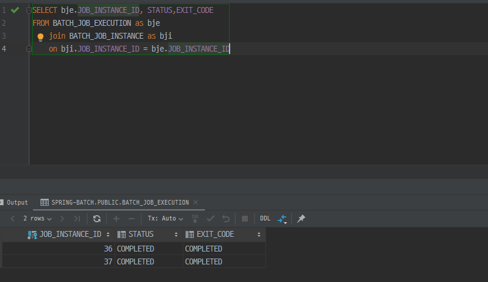

# Spring Batch

*Batch 를 통한 일괄처리*


***Spring Batch의 특성***

1. 자동화 - 개입 없이 `자동 실행`
2. 견고성 - `충돌/중단` 없는 안전한 처리
3. 신뢰성 -  이슈 처리를 추적 할 `로깅/알림` 기능
4. 성능 - 처리 완료와 독립적 수행의 대한 `퍼포먼스` 확보

***Spring의 DI,AOP,서비스 + [Accenture](https://www.accenture.com/us-en)의 Batch 노하우***


------


## Data `Reader`와 `Writer`를 지원

| DataSource | 기술      | 설명                          |
| ---------- | --------- | ----------------------------- |
| Database   | JDBC      | 페이징, 커서, 일괄 업데이트등 |
| Database   | Hibernate | 페이징, 커서                  |
| Database   | JPA       | 페이징 (커서 기능 삭제됨)     |
| File       | Flat file | 지정한 구분자로 파싱          |
| File       | XML       | XML 파싱                      |

```
Ibatis 모듈은 현재 삭재 되었고 JDBC ItemReader로 교체를 추천
```


------


## Spring Batch 기본 구조


 <span class='img_caption'>Source : [Spring Batch Architecture](https://terasoluna-batch.github.io/guideline/5.0.0.RELEASE/en/Ch02_SpringBatchArchitecture.html) </span> 


**1. Job**

- Batch Job의 한 단위

  ```java
      @Bean
      public Job jobBean(){
          return jobBuilderFactory.get("{Job Name}")
                  .start(stepBean())
                  .build();
      }
  ```

  

**2. Step**

- Job내부에서 수행될 1개의 Step

- Tasklet에 Step에서 수행할 기능으로 써 2가지의 형태가 존재

  - User 커스텀
  - Reader & Processor & Writer(RPW)가 한 묶음으로 존재

  ```java
      @Bean
      public Step stepBean(){
          return stepBuilderFactory.get("{Step Name}")
                  .tasklet(((contribution, chunkContext) -> { 
                      log.info("[========= This is Step ==========]");
                      return RepeatStatus.FINISHED;
                  }))
                  .build();
      }
  ```

  


------


## Srping Boot Meta Data

1. 이전 실행 Job History
2. 실패한 Batch와 Parameter / 성공한 Job
3. 실행 재개 지점
4. Job 기준 Step현황과 성공/실패 여부


 <span class='img_caption'>Source : [Spring Batch Doc](https://docs.spring.io/spring-batch/docs/3.0.x/reference/html/metaDataSchema.html) </span> 


해당 Table들은 Spring Batch 동작에 꼭 필요하며 `H2 DB`사용시 자동으로 생성되지만  

그외 DB들은 직접 생성해 주어야합니다

`DB DDL` 쿼리는 org.springframework.batch.core에 포함되어 있고 탐색 및 schema 검색으로 확인할 수 있습니다


1. **BATCH_JOB_INSTANCE**
   1. job이 실행 되는 단위
   2. job의 name/key/version 등의 정보를 가지고 있습니다
2. **BATCH_JOB_EXCUTION_PARAMS**
   1. job과 1:1의 관계를 갖는 parameters 입니다
   2. job과 1:1의 속성때문에 param이 다르면 job_instance가 새롭게 생성됩니다
   3. Map타입으로 지정데이터를 job에 넘길 수 있습니다


```java
    @Bean
    public Job jobBean() {
        return jobBuilderFactory.get("testJob")
                .start(stepBean(null))
                .build();
    }

    @Bean
    @JobScope
    public Step stepBean(@Value("#{jobParameters[requestDate]}") String requestDate) {
        return stepBuilderFactory.get("testStep")
                .tasklet(((contribution, chunkContext) -> { 
                    log.info("[========= This is Step ==========]");
                    log.info("[========= requestDate {} ==========]", requestDate);
                    return RepeatStatus.FINISHED;
                }))
                .build();
    }
```


 <span class='img_caption'>Spring Boot Batch Instance</span> 


 <span class='img_caption'>Spring Boot Batch Param</span>


- 동일 `Parameter`로 실행시 이미 `Instance`가 존재해서 에러가 납니다

  

 <span class='img_caption'>Parameter Exist Error</span>


3. **BATCH_JOB_EXECUTION**

   1. batch_job_instance와 대응되면서 `성공/실패` 내역을 갖고 있습니다
   2. process는 해당 table을 조회해서 재수행이 필요한 job만 처리 합니다

   

 <span class='img_caption'>BATCH_JOB_EXECUTION</span>


------


## Spring Batch Flow


```java
contribution.setExitStatus(ExitStatus.FAILED); //setExitStatus로 상태를 저장 할 수 있다
```


**흐름 제어**

1. on - 이전 step의 status에 대한 다음 행동
2. to - on과 연결된 다음 행동
3. end - 반환 / build 종료 2가지가 존재 맺음 메소드
4. from - on과 end 이외 추가전 이벤트 캐치 사용에 사용  


```java
@Slf4j
@Configuration
@AllArgsConstructor
public class JobSecondConfig {

    private final JobBuilderFactory jobBuilderFactory;
    private final StepBuilderFactory stepBuilderFactory;

    @Bean
    public Job jobSecondBean(){
        return jobBuilderFactory.get("testJob2")
                .start(jobStep1())
                    .on("FAILED")   //FAILED 이면
                    .to(jobStep3()) //step3 실행
                    .on("*") //to와 관계없이
                    .end()  //반환 종료
                .from(jobStep1())  //on을 사용한후 추가적 이벤트 캐치
                    .on("*")    //FAILED외의 모든 것
                    .to(jobStep2()) //step2 실행
                    .next(jobStep3())   //정상 종료되면 step3 실행
                    .on("*")    //step3 결과 상관없이
                    .end()  //반환 종료
                .end() //build 종료
                .build();
    }


    @Bean
    public Step jobStep1(){
        return stepBuilderFactory.get("step1")
                .tasklet((contribution, chunkContext) -> {
                    log.info("[========= This is Step1 ==========]");
                    contribution.setExitStatus(ExitStatus.FAILED);      //Status Failed
                    return RepeatStatus.FINISHED;
                })
                .build();
    }

    @Bean
    public Step jobStep2(){
        return stepBuilderFactory.get("step2")
                .tasklet((contribution, chunkContext) -> {
                    log.info("[========= This is Step2 ==========]");
                    return RepeatStatus.FINISHED;
                })
                .build();
    }

    @Bean
    public Step jobStep3(){
        return stepBuilderFactory.get("step3")
                .tasklet((contribution, chunkContext) -> {
                    log.info("[========= This is Step3 ==========]");
                    contribution.setExitStatus(ExitStatus.FAILED);      //Status Failed
                    return RepeatStatus.FINISHED;
                })
                .build();
    }

}

```


<span class='img_caption'>Fail Flow</span>


```java
    @Bean
    public Step jobStep1(){
        return stepBuilderFactory.get("step1")
                .tasklet((contribution, chunkContext) -> {
                    log.info("[========= This is Step1 ==========]");
                    /*
                    	contribution.setExitStatus(ExitStatus.FAILED);
                    */
                    return RepeatStatus.FINISHED;
                })
                .build();
    }

```


<span class='img_caption'>Standard  Flow</span>


**BATCH_STEP_EXECUTION**

*각각의 Step에 대한 성공 실패 여부가 기록됩니다*


<span class='img_caption'>BATCH_STEP_EXECUTION</span>


**위의 코드의 `문제점`**

1. `Step`이 Flow랑 Process처리라는 `2가지`의 역할을 수행 합니다

2. ExitStatus로는 다양한 `Flow 처리`에 번거로움이 있습니다


#### JobExecutionDecider 를 통한 Flow 처리

```java
   	@Bean
    public Job jobDeciderBean() {
        return jobBuilderFactory.get("deTestJob")
                .start(startStep())
                .next(decider())	//JobExecutionDecider()로직 처리
                .from(decider())	//JobExecutionDecider()결과 확인
                    .on("testDecide")
                    .to(startStep2())
                .end()
                .build();
    }

	@Bean
    public JobExecutionDecider decider() {
        return new jobDecider();
    }

    public static class jobDecider implements JobExecutionDecider{

        @Override	//조건 정의 method
        public FlowExecutionStatus decide(JobExecution jobExecution, StepExecution stepExecution) {
            return new FlowExecutionStatus("testDecide");
        }
    }


```


**JobExecutionDecider **로 Flow를 제어하여 역할을 분리하고 유동적으로 많은 조건들을 생성해서 적용 가능하다


------


