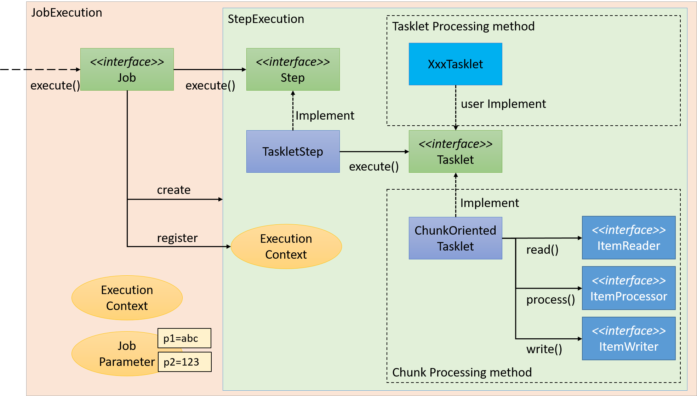
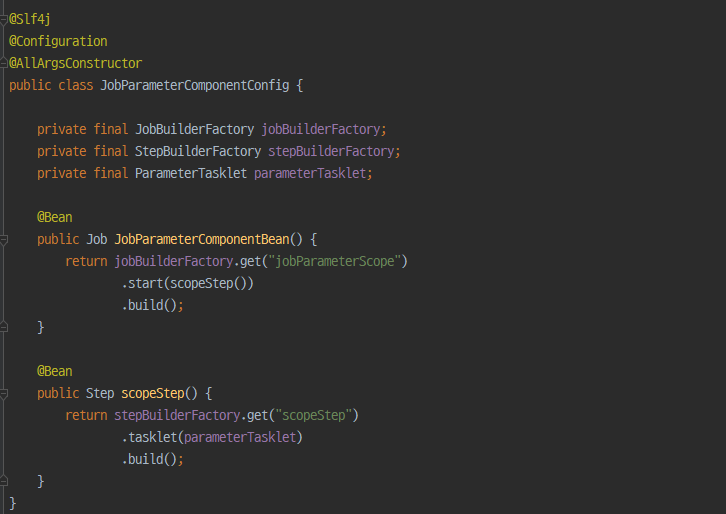
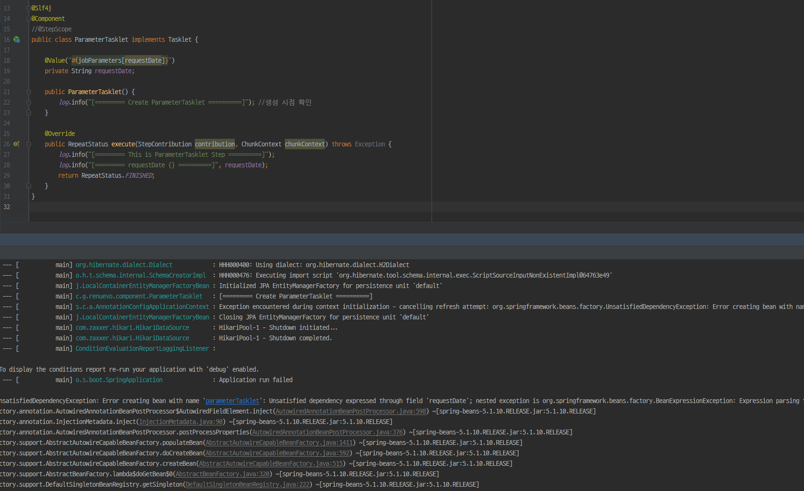
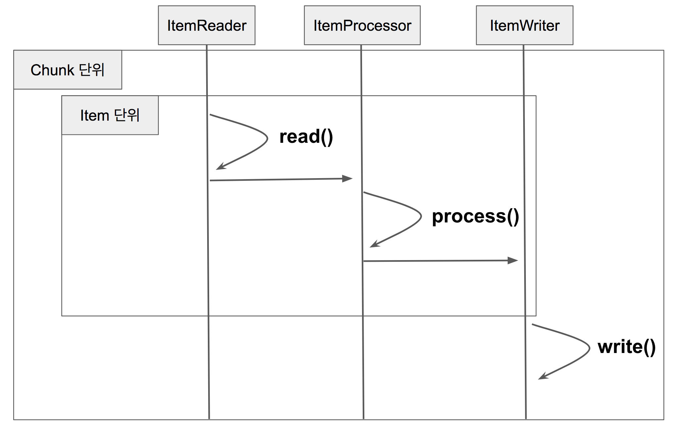

# Spring Batch

*Batch 를 통한 일괄처리*


***Spring Batch의 특성***

1. 자동화 - 개입 없이 `자동 실행`
2. 견고성 - `충돌/중단` 없는 안전한 처리
3. 신뢰성 -  이슈 처리를 추적 할 `로깅/알림` 기능
4. 성능 - 처리 완료와 독립적 수행의 대한 `퍼포먼스` 확보

***Spring의 DI,AOP,서비스 + [Accenture](https://www.accenture.com/us-en)의 Batch 노하우***  
해당 포스팅의 모든 소스는 [Github](https://github.com/renuevo/spring-boot-in-action)에서 확인하실 수 있습니다  


------


## Data `Reader`와 `Writer`를 지원

| DataSource | 기술      | 설명                          |
| ---------- | --------- | ----------------------------- |
| Database   | JDBC      | 페이징, 커서, 일괄 업데이트등 |
| Database   | Hibernate | 페이징, 커서                  |
| Database   | JPA       | 페이징 (커서 기능 삭제됨)     |
| File       | Flat file | 지정한 구분자로 파싱          |
| File       | XML       | XML 파싱                      |

```
Ibatis 모듈은 현재 삭재 되었고 JDBC ItemReader로 교체를 추천
```


------


## Spring Batch 기본 구조



 <span class='img_caption'>Source : [Spring Batch Architecture](https://terasoluna-batch.github.io/guideline/5.0.0.RELEASE/en/Ch02_SpringBatchArchitecture.html) </span> 


**1. Job**

- Batch Job의 한 단위

  ```java
      @Bean
      public Job jobBean(){
          return jobBuilderFactory.get("{Job Name}")
                  .start(stepBean())
                  .build();
      }
  ```

  

**2. Step**

- Job내부에서 수행될 1개의 Step

- Tasklet에 Step에서 수행할 기능으로 써 2가지의 형태가 존재

  - User 커스텀
  - Reader & Processor & Writer(RPW)가 한 묶음으로 존재

  ```java
      @Bean
      public Step stepBean(){
          return stepBuilderFactory.get("{Step Name}")
                  .tasklet(((contribution, chunkContext) -> { 
                      log.info("[========= This is Step ==========]");
                      return RepeatStatus.FINISHED;
                  }))
                  .build();
      }
  ```

  
**파라미터로 Job 실행 지정하기**

```yaml
spring:
  batch:
    job:
      names: ${job.name:NONE}

```

원하는 job을 외부 파라미터로 실행할 경우 다음과 같이 properties로 지정해 준다음 program argument 파라미터를 지정해 주시면 됩니다  
예를 들어 **jpaItemListWriterJob** 이라는 job을 실행하고 싶을 경우 다음과 같이 해주시면 됩니다  
```
program argument : --job.name=jpaItemListWriterJob
```


------


## Srping Boot Meta Data

1. 이전 실행 Job History
2. 실패한 Batch와 Parameter / 성공한 Job
3. 실행 재개 지점
4. Job 기준 Step현황과 성공/실패 여부


 <span class='img_caption'>Source : [Spring Batch Doc](https://docs.spring.io/spring-batch/docs/3.0.x/reference/html/metaDataSchema.html) </span> 


해당 Table들은 Spring Batch 동작에 꼭 필요하며 `H2 DB`사용시 자동으로 생성되지만  

그외 DB들은 직접 생성해 주어야합니다

`DB DDL` 쿼리는 org.springframework.batch.core에 포함되어 있고 탐색 및 schema 검색으로 확인할 수 있습니다


1. **BATCH\_JOB\_INSTANCE**
   1. job이 실행 되는 단위
   2. job의 name/key/version 등의 정보를 가지고 있습니다
2. **BATCH\_JOB\_EXCUTION_PARAMS**
   1. job과 1:1의 관계를 갖는 parameters 입니다
   2. job과 1:1의 속성때문에 param이 다르면 job_instance가 새롭게 생성됩니다
   3. Map타입으로 지정데이터를 job에 넘길 수 있습니다


```java
    @Bean
    public Job jobBean() {
        return jobBuilderFactory.get("testJob")
                .start(stepBean(null))
                .build();
    }

    @Bean
    @JobScope
    public Step stepBean(@Value("#{jobParameters[requestDate]}") String requestDate) {
        return stepBuilderFactory.get("testStep")
                .tasklet(((contribution, chunkContext) -> { 
                    log.info("[========= This is Step ==========]");
                    log.info("[========= requestDate {} ==========]", requestDate);
                    return RepeatStatus.FINISHED;
                }))
                .build();
    }
```


 <span class='img_caption'>Spring Boot Batch Instance</span> 


 <span class='img_caption'>Spring Boot Batch Param</span>


- 동일 `Parameter`로 실행시 이미 `Instance`가 존재해서 에러가 납니다

  

 <span class='img_caption'>Parameter Exist Error</span>


3. **BATCH\_JOB\_EXECUTION**

   1. batch\_job\_instance와 대응되면서 `성공/실패` 내역을 갖고 있습니다
   2. process는 해당 table을 조회해서 재수행이 필요한 job만 처리 합니다

   

 <span class='img_caption'>BATCH_JOB_EXECUTION</span>


------


## Spring Batch Flow


```java
contribution.setExitStatus(ExitStatus.FAILED); //setExitStatus로 상태를 저장 할 수 있다
```


**흐름 제어**

1. on - 이전 step의 status에 대한 다음 행동
2. to - on과 연결된 다음 행동
3. end - 반환 / build 종료 2가지가 존재 맺음 메소드
4. from - on과 end 이외 추가전 이벤트 캐치 사용에 사용  


```java
@Slf4j
@Configuration
@AllArgsConstructor
public class JobSecondConfig {

    private final JobBuilderFactory jobBuilderFactory;
    private final StepBuilderFactory stepBuilderFactory;

    @Bean
    public Job jobSecondBean(){
        return jobBuilderFactory.get("testJob2")
                .start(jobStep1())
                    .on("FAILED")   //FAILED 이면
                    .to(jobStep3()) //step3 실행
                    .on("*") //to와 관계없이
                    .end()  //반환 종료
                .from(jobStep1())  //on을 사용한후 추가적 이벤트 캐치
                    .on("*")    //FAILED외의 모든 것
                    .to(jobStep2()) //step2 실행
                    .next(jobStep3())   //정상 종료되면 step3 실행
                    .on("*")    //step3 결과 상관없이
                    .end()  //반환 종료
                .end() //build 종료
                .build();
    }


    @Bean
    public Step jobStep1(){
        return stepBuilderFactory.get("step1")
                .tasklet((contribution, chunkContext) -> {
                    log.info("[========= This is Step1 ==========]");
                    contribution.setExitStatus(ExitStatus.FAILED);      //Status Failed
                    return RepeatStatus.FINISHED;
                })
                .build();
    }

    @Bean
    public Step jobStep2(){
        return stepBuilderFactory.get("step2")
                .tasklet((contribution, chunkContext) -> {
                    log.info("[========= This is Step2 ==========]");
                    return RepeatStatus.FINISHED;
                })
                .build();
    }

    @Bean
    public Step jobStep3(){
        return stepBuilderFactory.get("step3")
                .tasklet((contribution, chunkContext) -> {
                    log.info("[========= This is Step3 ==========]");
                    contribution.setExitStatus(ExitStatus.FAILED);      //Status Failed
                    return RepeatStatus.FINISHED;
                })
                .build();
    }

}

```


<span class='img_caption'>Fail Flow</span>


```java
    @Bean
    public Step jobStep1(){
        return stepBuilderFactory.get("step1")
                .tasklet((contribution, chunkContext) -> {
                    log.info("[========= This is Step1 ==========]");
                    /*
                    	contribution.setExitStatus(ExitStatus.FAILED);
                    */
                    return RepeatStatus.FINISHED;
                })
                .build();
    }

```


<span class='img_caption'>Standard Flow</span>


**BATCH\_STEP\_EXECUTION**

*각각의 Step에 대한 성공 실패 여부가 기록됩니다*


<span class='img_caption'>BATCH_STEP_EXECUTION</span>


**위의 코드의 `문제점`**

1. `Step`이 Flow랑 Process처리라는 `2가지`의 역할을 수행 합니다

2. ExitStatus로는 다양한 `Flow 처리`에 번거로움이 있습니다


### JobExecutionDecider 를 통한 Flow 처리

```java
   	@Bean
    public Job jobDeciderBean() {
        return jobBuilderFactory.get("deTestJob")
                .start(startStep())
                .next(decider())	//JobExecutionDecider()로직 처리
                .from(decider())	//JobExecutionDecider()결과 확인
                    .on("testDecide")
                    .to(startStep2())
                .end()
                .build();
    }

	@Bean
    public JobExecutionDecider decider() {
        return new jobDecider();
    }

    public static class jobDecider implements JobExecutionDecider{

        @Override	//조건 정의 method
        public FlowExecutionStatus decide(JobExecution jobExecution, StepExecution stepExecution) {
            return new FlowExecutionStatus("testDecide");
        }
    }


```


**JobExecutionDecider **로 Flow를 제어하여 역할을 분리하고 유동적으로 많은 조건들을 생성해서 적용 가능하다


------


## JobParameter & Scope

*Barch Component에서 사용할 수 있게 지원되는 파라미터*  


```java
@Value("#{jobParameters[parameterName]}")
```


**JobParameter Scope**  

1. JobScope : Step 사용시 사용  
2. StepScope : Tasklet 사용시 사용  

`Double`,`Long`,`Date`,`String` 형식만을 지원합니다  


```
program argument : --job.name=jobScope requestDate=20200203
```


```java

@Slf4j
@Configuration
@AllArgsConstructor
public class JobParameterConfig {

    private final JobBuilderFactory jobBuilderFactory;
    private final StepBuilderFactory stepBuilderFactory;

    @Bean
    public Job jobScopeBean() {
        return jobBuilderFactory.get("jobScope")
                .start(scopeStep1(null))
                .next(scopeStep2())
                .build();
    }

    @Bean
    @JobScope   //Step에 대해서 설정
    public Step scopeStep1(@Value("#{jobParameters[requestDate]}") String requestDate) {
        return stepBuilderFactory.get("scopeStep1")
                .tasklet((contribution, chunkContext) -> {
                    log.info("[========= This is scopeStep1 ==========]");
                    log.info("{}",requestDate);
                    return RepeatStatus.FINISHED;
                }).build();
    }

    @Bean
    public Step scopeStep2(){
        return stepBuilderFactory.get("scopeStep2")
                .tasklet(scopeStep2Tasklet(null))
                .build();
    }

    @Bean
    @StepScope  //Tasklet에 대해서 설정
    public Tasklet scopeStep2Tasklet(@Value("#{jobParameters[requestDate]}") String requestDate){
        return (contribution, chunkContext) -> {
            log.info("[========= This is scopeStep2 ==========]");
            log.info("{}",requestDate);
            return RepeatStatus.FINISHED;
        };
    }

}

```


```
@Bean에 @StepScope와 @JobScope를 같이 사용하면 Step의 시작과 종료시 생성/삭제가 이루어지게 됩니다  
```


1. JobParameter의 Late Binding

   일반적인 Bean 생성시점이 아닌 지점에서 생성 되므로 `Controller`와 `Service`와 같은 **비지니스 로직 처리단계에서 Job Parameter를 할당** 할 수 있게 됩니다

2. Component Parallel Processing 

   일반적인 `Singleton` 처럼 생성되면 각각의 Step에서 Tasklet의 멤버변수등의 상태를 수정하는 일이 생기면서 데이터가 덮어써지게 됩니다 :point_right: [Race Condition 문제](https://ko.wikipedia.org/wiki/경쟁_상태)  

   `@StepScope`로 **각각의 Step별로 별도의 Tasklet를 생성**하고 관리하게 하므로써 이러한 문제를 해결 할 수 있습니다


### JobParameter 주의 사항  

1. JobParameter는 `@Value`를 통해서만 값을 할당 받을 수 있습니다  
2. `@JobScope`와 `@StepScope`로 **Bean**을 생성할때만 Jobparameter가 생성되어 사용 할 수 있습니다  


<span class='code_header'>**Job Parameter Bean**</span>  

  


<span class='code_header'>**Job Tasklet**</span>  

  


<span class='code_header'>**Result**</span>  

  


만약 `@StepScope`가 없는 Bean에  Jobparameter를 지정하게 되면 `생성시점` 때문에  <span class='red_font'>error</span>가 납니다  

   


### JobParameter를 사용하는 이유  
1. Late Binding (Command Line실행외의 다른 실행이 어려워 진다)    
   *다음과 같이 동적 parameter의 대한 대응을 할 수 없습니다*  

   ```java
   @Slf4j
   @RestController
   public class JobController {	//단순 예제
   
       private final JobLauncher jobLauncher;
       private final Job job;
   
       public JobController(JobLauncher jobLauncher, @Qualifier("JobParameterBean") Job job) {
           this.jobLauncher = jobLauncher;
           this.job = job;
       }
   
       @GetMapping("/launchjob")
       public String handle(@RequestParam("requestDate") String requestDate) {
           try {
               JobParameters jobParameters = new JobParametersBuilder()
                       .addString("requestDate", requestDate)
                       .addLong("time", System.currentTimeMillis())
                       .toJobParameters();
               jobLauncher.run(job, jobParameters);
           } catch (Exception e) {
               log.error("Error : {}", e.getMessage(), e);
           }
           return "Deon";
       }
   }
   
   ```

     
   ***Spring Batch에서는 웹서버로 Batch를 관리하기를 `권장하지 않습니다`*** :exclamation:  


2. Meta Table의 활용성 (Job과 Parameter의 `1:1` 관계)  
   *이 처럼 Meta Table을 활용하여 Job을 1번만 실행하는지의 여부 확인이 어려워 집니다*  
     


### @Bean과 @StepScope를 같이 사용할 때 주의사항

[기억보단 기록을 블로그의 StepScope 사용시 주의사항](https://jojoldu.tistory.com/132)을 정리해서 요약했습니다  
Spring Batch에서 ItemReader를 구현시 `@Bean`을 사용해서 구현하곤 합니다  
문제는 `@Bean`과 JobParameter를 같이 써야 하면서 `@StepScope`를 같이 추가하면서 일어납니다  

```java

@Bean
@StepScope
public ItemReader<Test> reader(@Value("#{jobParameters[parameter]}") String parameter){

    ...

    JpaPagingItemReader<Test> reader = new JpaPagingItemReader<>();
    
    ...
    
    return reader;
}

```
해당 코드와 같이 사용하고 일반적으로 `JpaPagingItemReader`를 사용하게 되면 `ItemStream` 인터페이스를 가지고 있지 않아서 <span class='red_font'>Error</span>가 납니다  
이유인 즉 `@StepScope`가 선언됨에 따라 Bean이 `Proxy`로 설정 되면서 실제 생성한것과 다르게 *ItemReader로 return 되기 때문입니다*  

```java
@Scope(value = "step", proxyMode = ScopedProxyMode.TARGET_CLASS)
@Retention(RetentionPolicy.RUNTIME)
@Documented
public @interface StepScope {}
```

Scope의 관해서 자세히 알고 싶으시면 제 블로그의 다른 글 :point_right: [Spring Scope의 관해서](https://renuevo.github.io/spring/scope/spring-scope/)을 확인 하시기 바랍니다  

---
## Chunk 지향 처리  
Spring Batch의 가장 큰 장점 중 하나는 `Chunk` 지향 처리입니다  
`Chunk`지향처리란 **한 번에 하나씩의 데이터를 읽어 Chunk라는 덩어리를 만든 뒤, Chunk 단위로 트랜잭션**을 다루는 것을 의미합니다  
그래서 트랜잭션을 수행시 `Chunk`단위로 수행하기 때문에 Chunk 만큼만 롤백 됩니다  

  
<span class='img_caption'> Source : [Spring Batch Docs Chunk-oriented](https://docs.spring.io/spring-batch/docs/4.0.x/reference/html/index-single.html#chunkOrientedProcessing)</span>

위의 그림은 Spring Batch에서 Item단위로 처리 프로세스가 어떻게 이루어지는지 나타냅니다  
**ItemReader와 ItemProcessor를 처리한뒤 마지막에 ItemWriter으로 전달 합니다** 

<br/> 

  
<span class='img_caption'> Source : [기억보단 기록을 Chunk 지향처리](https://jojoldu.tistory.com/331)</span>  
위의 그림은 이해를 돕기 위한 그림입니다  
**Reader와 Processor가 Item을 1건씩 처리하고 Chunk단위 만큼 처리가 끝나면 Writer쪽으로 전달되어 일괄 처리 됩니다**  

### Page Size 와 Chunk Size  
Spring Batch에서 일반적으로 Reader로 `PagingItemReader`를 많이들 사용합니다  
일반적으로 Page Size와 Chunk Size를 같은 의미로 생각할 수 있습니다  
**하지만 Page Size와 Chunk Size는 서로 의미하는 바가 다릅니다**  

<br/>

**1. Chunk Size는 한번에 처리될 트랜잭션 단위**  
**2. Page Size는 한번에 조회할 Item의 양**  

<br/>

아래 코드로 ItemReader에서 Read가 이루어지는 경우를 한눈에 볼 수 있습니다  
```java

@Override
protected T doRead() throws Exception {

    synchronized (lock) {
        
        //results가 없거나, index가 pageSize를 초과한 경우
        if (results == null || current >= pageSize) {

            if (logger.isDebugEnabled()) {
                logger.debug("Reading page " + getPage());
            }
        
            //신규 Item을 읽어서 results list에 추가한다
            doReadPage();
            page++;
            if (current >= pageSize) {
                current = 0;
            }

        }

        int next = current++;
        if (next < results.size()) {
            return results.get(next);
        }
        else {
            return null;
        }

    }

}

```
다음과 같이 Read는 `Page Size` 단위로 이루어지며 **쿼리 실행시 Page의 Size를 지정하기 위한 용도**입니다  
**Chunk는 Item이 처리되는 단위**이며 이 때문에 **Chunk Size와 Page Size가 다를 경우 불필요한 Read가 발생할 수 있습니다**

<br/>

`즉 Chunk Size가 Page Size보다 클경우 Chunk Size를 만족할 만큼의 Page Read가 이루어 집니다`

<br/>

그래서 JpaPagingItemReader에서는 다음과 같이 주석으로 알려주고 있습니다  

```java
/*
 * <p>
 * Setting a fairly large page size and using a commit interval that matches the
 * page size should provide better performance.
 * </p>
 */

public class JpaPagingItemReader<T> extends AbstractPagingItemReader<T> {
    ...
}
```

```textbox
상당히 큰 페이지 크기를 설정하고 페이지 크기와 일치하는 커미트 간격을 사용하면 성능이 향상됩니다
```

**즉 Chunk Size와 Page Size를 일치 시키는게 보편적으로 좋은 방법입니다**

* JPA에서의 영속성 컨텍스트가 깨지는 문제도 있을 수 있다고 합니다  
관련 정리 :point_right: [영속성 컨텍스트 문제](https://jojoldu.tistory.com/146)

<br/>

---

앞서 본것과 같이 Chunk 지향처리 `3가지`의 구성요소로 이루어져 있습니다  

1. ItemReader  
2. ItemProcessor  
3. ItemWriter  

지금부터 이 3가지 요소의 대해 알아보도록 하겠습니다  

## ItemReader  

Data -> ItemReader -> ItemProcessor -> ItemWriter -> Data
`ItemReader`는 데이터를 읽어 들이는 역할을 합니다  
Spring Batch에서는 다양한 데이터를 읽어 올 수 있도록 기본적인 구현체를 제공하고 있습니다  
또한  사용자 개인이 커스텀하여 다양한 형태의 데이터도 읽어 올 수 있도록 확장성도 열어 두었습니다  


```java

public interface ItemReader<T> {
    T read() throws Exception, UnexpectedInputException, ParseException, NonTransientResourceException;
} 

```


---
## ItemWriter  


---

## Elastic Reader And Writer  
이번엔 Elastic과 Spring Batch를 같이 쓰는 방법을 알아 보겠습니다  
저는 spring-data-elasticsearch를 사용하지 않고 elastic-rest-client를 사용해서 구현하였습니다  
`spring-data-elasticsearch`를 사용하시는 분은 해당 [Github](https://github.com/spring-projects/spring-batch-extensions/tree/master/spring-batch-elasticsearch)을 참고해 주시기 바랍니다  

<br/>

### Elastic Test Data Bulk  

**<span class='sub_header'>Test Index Mapping Json</span>**  
```json

PUT reader_test
{
  "settings": {
    "index": {
      "number_of_shards": 3,
      "number_of_replicas": 1
    }
  },
  "mappings": {
    "properties": {
      "key": {
        "type": "integer"
      },
      "name": {
        "type": "text",
        "analyzer": "nori",
        "fields": {
          "keyword": {
            "type": "keyword"
          }
        }
      }
    }
  }
}

```

<br/>

**<span class='sub_header'>Test Data Bulk</span>**  

```json

POST reader_test/doc/_bulk
{"index":{}}
{"key": 1,"name": "test1"}
{"index":{}}
{"key": 2,"name": "test2"}
{"index":{}}
{"key": 3,"name": "test3"}
{"index":{}}
{"key": 4,"name": "test4"}
{"index":{}}
{"key": 5,"name": "test5"}
{"index":{}}
{"key": 6,"name": "test6"}
{"index":{}}
{"key": 7,"name": "test7"}
{"index":{}}
{"key": 8,"name": "test8"}
{"index":{}}
{"key": 9,"name": "test9"}
{"index":{}}
{"key": 10,"name": "test10"}

```


일단 테스트 데이터 부터 생성해 줍니다  
그리고 Spring Batch에서 사용할 Reader를 구현하기 위해서는 ItemReader만 구현해 주면 됩니다  


---
## ItemProcessor  


---
## Spring Batch Test  


---
## Spring Batch Partitioner


---
## Spring Batch Exception Handling

---


[Spring Batch Doc](https://docs.spring.io/spring-batch/docs/current/reference/html/index.html)   
[Spring Batch Guideline](https://terasoluna-batch.github.io/guideline/5.0.0.RELEASE/en/Ch02_SpringBatchArchitecture.html)
[기억보단 기록을](https://jojoldu.tistory.com/)   
[구피개발일기](https://wckhg89.github.io/archivers/springbatch1)  
[티몬의 개발이야기](http://blog.naver.com/PostView.nhn?blogId=tmondev&logNo=220772936562&categoryNo=6&parentCategoryNo=0&viewDate=&currentPage=1&postListTopCurrentPage=1&from=postView&userTopListOpen=true&userTopListCount=30&userTopListManageOpen=false&userTopListCurrentPage=1)  